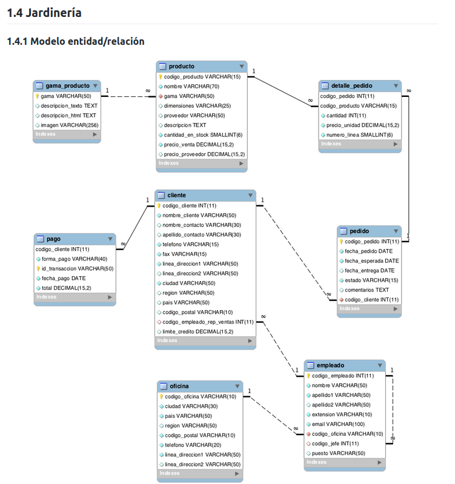

# JARDINERIA

## DESCRIPCION

En este repositorio se encuentra la base de datos sobre jardineria y el readme con sus consultas.

## MODELO FISICO



## CONSULTAS JARDINERIA

### 1.4.5 Consultas multitabla (Composición interna) - PRIMER GRUPO

Resuelva todas las consultas utilizando la sintaxis de sql1 y sql2. Las consultas con sintaxis de sql2 se deben resolver con INNER JOIN y NATURAL JOIN.

1. Obtén un listado con el nombre de cada cliente y el nombre y apellido de su representante de ventas.

    ```sql
    SELECT c.nombre_cliente AS nombre_cliente, CONCAT(e.nombre, ' ', e.apellido1, ' ', e.apellido2) AS nombre_representante_ventas
    FROM cliente c
    JOIN empleado e ON c.codigo_empleado_rep_ventas = e.codigo_empleado
    ORDER BY nombre_cliente ASC;
    ```

2. Muestra el nombre de los clientes que hayan realizado pagos junto con el nombre de sus representantes de ventas.

    ```sql
    SELECT c.nombre_cliente AS nombre_cliente, CONCAT(e.nombre, ' ', e.apellido1, ' ', e.apellido2) AS nombre_representante_ventas
    FROM cliente c
    JOIN pago p ON c.codigo_cliente = p.codigo_cliente
    JOIN empleado e ON e.codigo_empleado = c.codigo_empleado_rep_ventas
    ORDER BY nombre_cliente ASC;
    ```

3. Muestra el nombre de los clientes que no hayan realizado pagos junto con el nombre de sus representantes de ventas.

    ```sql
    SELECT c.nombre_cliente AS nombre_cliente, CONCAT(e.nombre, ' ', e.apellido1, ' ', e.apellido2) AS nombre_representante_ventas
    FROM cliente c
    LEFT JOIN pago p ON c.codigo_cliente = p.codigo_cliente
    JOIN empleado e ON e.codigo_empleado = c.codigo_empleado_rep_ventas
    WHERE p.codigo_cliente IS NULL
    ORDER BY nombre_cliente ASC;
    ```

4. Devuelve el nombre de los clientes que han hecho pagos y el nombre de sus representantes junto con la ciudad de la oficina a la que pertenece el representante.

    ```sql
    SELECT c.nombre_cliente AS nombre_cliente, CONCAT(e.nombre, ' ', e.apellido1, ' ', e.apellido2) AS nombre_representante_ventas, CONCAT(o.ciudad) AS ciudad_oficina
    FROM cliente c
    JOIN pago p ON c.codigo_cliente = p.codigo_cliente
    JOIN empleado e ON c.codigo_empleado_rep_ventas = e.codigo_empleado
    JOIN oficina o ON e.codigo_oficina = o.codigo_oficina
    ORDER BY nombre_cliente ASC;
    ```

5. Devuelve el nombre de los clientes que no hayan hecho pagos y el nombre de sus representantes junto con la ciudad de la oficina a la que pertenece el representante.

    ```sql
    SELECT c.nombre_cliente AS nombre_cliente, CONCAT(e.nombre, ' ', e.apellido1, ' ', e.apellido2) AS nombre_representante_ventas, CONCAT(o.ciudad) AS ciudad_oficina
    FROM cliente c
    LEFT JOIN pago p ON c.codigo_cliente = p.codigo_cliente
    JOIN empleado e ON c.codigo_empleado_rep_ventas = e.codigo_empleado
    JOIN oficina o ON e.codigo_oficina = o.codigo_oficina
    WHERE p.codigo_cliente IS NULL
    ORDER BY nombre_cliente ASC;
    ```

6. Lista la dirección de las oficinas que tengan clientes en Fuenlabrada.

    ```sql
    SELECT DISTINCT CONCAT('Principal: ', o.linea_direccion1, ' Complemento: ', o.linea_direccion2) AS Dirección_Oficina
    FROM oficina o
    JOIN empleado e ON o.codigo_oficina = e.codigo_oficina
    JOIN cliente c ON e.codigo_empleado = c.codigo_empleado_rep_ventas
    WHERE c.ciudad = "Fuenlabrada"
    ORDER BY Dirección_Oficina ASC;
    ```

7. Devuelve el nombre de los clientes y el nombre de sus representantes junto con la ciudad de la oficina a la que pertenece el representante.

    ```sql
    SELECT c.nombre_cliente AS nombre_cliente, CONCAT(e.nombre, ' ', e.apellido1, ' ', e.apellido2) AS nombre_representante, CONCAT(o.ciudad) AS ciudad_oficina
    FROM cliente c
    JOIN empleado e ON c.codigo_empleado_rep_ventas = e.codigo_empleado
    JOIN oficina o ON e.codigo_oficina = o.codigo_oficina
    ORDER BY nombre_cliente ASC;
    ```

8. Devuelve un listado con el nombre de los empleados junto con el nombre de sus jefes.

    ```sql
    SELECT CONCAT(e.nombre, ' ', e.apellido1, ' ', e.apellido2) AS nombre_empleado, CONCAT(e2.nombre, ' ', e2.apellido1, ' ', e2.apellido2) AS nombre_jefe
    FROM empleado e
    JOIN empleado e2 ON e.codigo_jefe = e2.codigo_empleado
    ORDER BY nombre_empleado ASC;
    ```

9. Devuelve un listado que muestre el nombre de cada empleados, el nombre de su jefe y el nombre del jefe de sus jefe.

    ```sql
    SELECT CONCAT(e.nombre, ' ', e.apellido1, ' ', e.apellido2) AS nombre_empleado, CONCAT(e2.nombre, ' ', e2.apellido1, ' ', e2.apellido2) AS nombre_jefe, CONCAT(e3.nombre, ' ', e3.apellido1, ' ', e3.apellido2) AS nombre_jefe_del_jefe
    FROM empleado e
    JOIN empleado e2 ON e.codigo_jefe = e2.codigo_empleado
    JOIN empleado e3 ON e2.codigo_jefe = e3.codigo_empleado
    ORDER BY nombre_empleado ASC;
    ```

10. Devuelve el nombre de los clientes a los que no se les ha entregado a tiempo un pedido.

    ```sql
    SELECT c.nombre_cliente AS nombre_cliente
    FROM cliente c
    JOIN pedido p ON c.codigo_cliente = p.codigo_cliente
    WHERE fecha_entrega > fecha_esperada OR fecha_entrega IS NULL
    ORDER BY nombre_cliente ASC;
    ```

11. Devuelve un listado de las diferentes gamas de producto que ha comprado cada cliente.

    ```sql
    SELECT c.codigo_cliente, GROUP_CONCAT(DISTINCT pr.gama) AS gama_producto
    FROM cliente c
    JOIN pedido p ON c.codigo_cliente = p.codigo_cliente
    JOIN detalle_pedido d ON p.codigo_pedido = d.codigo_pedido
    JOIN producto pr ON d.codigo_producto = pr.codigo_producto
    GROUP BY codigo_cliente
    ORDER BY codigo_cliente;
    ```

### 1.4.6 Consultas multitabla (Composición externa) - SEGUNDO GRUPO

Resuelva todas las consultas utilizando las cláusulas LEFT JOIN, RIGHT JOIN, NATURAL LEFT JOIN y NATURAL RIGHT JOIN.

1. Devuelve un listado que muestre solamente los clientes que no han realizado ningún pago.

    ```sql
    SELECT c.*
    FROM cliente c
    LEFT JOIN pago p ON c.codigo_cliente = p.codigo_cliente
    WHERE p.codigo_cliente IS NULL
    ORDER BY c.nombre_cliente;
    ```

2. Devuelve un listado que muestre solamente los clientes que no han realizado ningún pedido.

    ```sql
    SELECT c.*
    FROM cliente c
    LEFT JOIN pedido p ON c.codigo_cliente = p.codigo_cliente
    WHERE p.codigo_cliente IS NULL
    ORDER BY c.nombre_cliente;
    ```

3. Devuelve un listado que muestre los clientes que no han realizado ningún pago y los que no han realizado ningún pedido.

    ```sql
    SELECT c.*
    FROM cliente c
    LEFT JOIN pago p ON c.codigo_cliente = p.codigo_cliente
    LEFT JOIN pedido pe ON c.codigo_cliente = pe.codigo_cliente
    WHERE p.codigo_cliente IS NULL OR pe.codigo_cliente IS NULL
    ORDER BY c.nombre_cliente;
    ```

4. Devuelve un listado que muestre solamente los empleados que no tienen una oficina asociada.

    ```sql
    SELECT e.*
    FROM empleado e
    LEFT JOIN oficina o ON e.codigo_oficina = o.codigo_oficina
    WHERE o.codigo_oficina IS NULL
    ORDER BY e.nombre;
    ```

5. Devuelve un listado que muestre solamente los empleados que no tienen un cliente asociado.

    ```sql
    SELECT e.*
    FROM empleado e
    LEFT JOIN cliente c ON e.codigo_empleado = c.codigo_empleado_rep_ventas
    WHERE c.codigo_empleado_rep_ventas IS NULL
    ORDER BY e.nombre;
    ```

6. Devuelve un listado que muestre solamente los empleados que no tienen un cliente asociado junto con los datos de la oficina donde trabajan.

    ```sql
    SELECT e.*, o.*
    FROM empleado e
    LEFT JOIN cliente c ON e.codigo_empleado = c.codigo_empleado_rep_ventas
    LEFT JOIN oficina o ON e.codigo_oficina = o.codigo_oficina
    WHERE c.codigo_empleado_rep_ventas IS NULL
    ORDER BY e.nombre;
    ```

7. Devuelve un listado que muestre los empleados que no tienen una oficina asociada y los que no tienen un cliente asociado.

    ```sql
    SELECT e.*
    FROM empleado e
    LEFT JOIN cliente c ON e.codigo_empleado = c.codigo_empleado_rep_ventas
    LEFT JOIN oficina o ON e.codigo_oficina = o.codigo_oficina
    WHERE c.codigo_empleado_rep_ventas IS NULL OR o.codigo_oficina IS NULL
    ORDER BY e.nombre;
    ```

8. Devuelve un listado de los productos que nunca han aparecido en un pedido.

    ```sql
    SELECT DISTINCT p.*
    FROM producto p
    LEFT JOIN detalle_pedido d ON p.codigo_producto = d.codigo_producto
    WHERE d.codigo_producto IS NULL
    ORDER BY p.nombre;
    ```

9. Devuelve un listado de los productos que nunca han aparecido en un pedido. El resultado debe mostrar el nombre, la descripción y la imagen del producto.

    ```sql
    SELECT DISTINCT p.nombre AS nombre_producto, p.descripcion AS descripcion_producto, g.imagen AS imagen_producto
    FROM producto p
    LEFT JOIN detalle_pedido d ON p.codigo_producto = d.codigo_producto
    LEFT JOIN gama_producto g ON p.gama = g.gama
    WHERE d.codigo_producto IS NULL
    ORDER BY p.nombre;
    ```

10. Devuelve las oficinas donde no trabajan ninguno de los empleados que hayan sido los representantes de ventas de algún cliente que haya realizado la compra de algún producto de la gama Frutales.

    ```sql
    SELECT DISTINCT o.*
    FROM oficina o
    JOIN empleado e ON o.codigo_oficina = e.codigo_oficina
    JOIN cliente c ON e.codigo_empleado = c.codigo_empleado_rep_ventas
    JOIN pedido p ON c.codigo_cliente = p.codigo_cliente
    JOIN detalle_pedido d ON p.codigo_pedido = d.codigo_pedido
    JOIN producto pr ON d.codigo_producto = pr.codigo_producto
    WHERE pr.gama != 'Frutales';
    ```

11. Devuelve un listado con los clientes que han realizado algún pedido pero no han realizado ningún pago.

    ```sql
    SELECT DISTINCT c.*
    FROM cliente c
    JOIN pedido pe ON c.codigo_cliente = pe.codigo_cliente
    LEFT JOIN pago p ON c.codigo_cliente = p.codigo_cliente
    WHERE p.codigo_cliente IS NULL
    ORDER BY c.nombre_cliente;
    ```

12. Devuelve un listado con los datos de los empleados que no tienen clientes asociados y el nombre de su jefe asociado.

    ```sql
    SELECT DISTINCT e.*, CONCAT(e2.nombre, ' ', e2.apellido1, ' ', e2.apellido2) AS nombre_jefe
    FROM empleado e
    LEFT JOIN cliente c ON e.codigo_empleado = c.codigo_empleado_rep_ventas
    LEFT JOIN empleado e2 ON e.codigo_jefe = e2.codigo_empleado
    WHERE c.codigo_empleado_rep_ventas IS NULL
    ORDER BY e.nombre;
    ```

### Consultas - TERCER GRUPO

1. Devuelve un listado con el código de oficina y la ciudad donde hay oficinas.
   
    ```sql
    SELECT o.codigo_oficina, o.ciudad
    FROM oficina o
    ORDER BY o.codigo_oficina;
    ```

2. Devuelve un listado con la ciudad y el teléfono de las oficinas de España.
    
    ```sql
    SELECT o.ciudad, o.telefono
    FROM oficina o
    WHERE o.pais = 'España'
    ORDER BY o.ciudad;
    ```

3. Devuelve un listado con el nombre, apellidos y email de los empleados cuyo jefe tiene un código de jefe igual a 7.
    
    ```sql
    SELECT o.nombre, o.apellido1, o.apellido2, o.email
    FROM empleado o
    WHERE o.codigo_jefe = 7
    ORDER BY o.nombre;
    ```

4. Devuelve el nombre del puesto, nombre, apellidos y email del jefe de la empresa.

    ```sql
    SELECT e.puesto, e.nombre, e.apellido1, e.apellido2, e.email
    FROM empleado e
    WHERE e.codigo_jefe IS NULL
    ORDER BY e.nombre;
    ```

5. Devuelve un listado con el nombre, apellidos y puesto de aquellos empleados que no sean representantes de ventas.

    ```sql
    SELECT e.nombre, e.apellido1, e.apellido2, e.puesto
    FROM empleado e
    LEFT JOIN cliente c ON e.codigo_empleado = c.codigo_empleado_rep_ventas
    WHERE c.codigo_empleado_rep_ventas IS NULL
    ORDER BY e.nombre;
    ```
6. Devuelve un listado con el nombre de los todos los clientes españoles.

    ```sql
    SELECT c.nombre_cliente
    FROM cliente c
    WHERE c.pais = 'Spain'
    ORDER BY c.nombre_cliente;
    ```

7. Devuelve un listado con los distintos estados por los que puede pasar un pedido.

    ```sql
    SELECT DISTINCT p.estado
    FROM pedido p
    ORDER BY p.estado;
    ```

8. Devuelve un listado con el código de cliente de aquellos clientes que realizaron algún pago en 2008. Tenga en cuenta que deberá eliminar aquellos códigos de cliente que aparezcan repetidos. Resuelva la consulta:

Utilizando la función YEAR de Mysql.

- Utilizando la función DATE_FORMAT de Mysql.
- Sin utilizar ninguna de las funciones anteriores.

    <!-- CON YEAR -->
    ```sql
    SELECT DISTINCT c.codigo_cliente
    FROM cliente c
    JOIN pago p ON c.codigo_cliente = p.codigo_cliente
    WHERE YEAR(fecha_pago) = 2008
    ORDER BY c.codigo_cliente;
    ```

    <!-- CON DATE_FORMAT -->
    ```sql
    SELECT DISTINCT c.codigo_cliente
    FROM cliente c
    JOIN pago p ON c.codigo_cliente = p.codigo_cliente
    WHERE DATE_FORMAT(p.fecha_pago, "%Y") = 2008
    ORDER BY c.codigo_cliente;
    ```

    <!-- SIN FUNCIONES -->
    ```sql
    SELECT DISTINCT c.codigo_cliente
    FROM cliente c
    JOIN pago p ON c.codigo_cliente = p.codigo_cliente
    WHERE SUBSTRING(p.fecha_pago, 1, 4) = 2008
    ORDER BY c.codigo_cliente;
    ```

9. Devuelve un listado con el código de pedido, código de cliente, fecha esperada y fecha de entrega de los pedidos que no han sido entregados a tiempo.

    ```sql
    SELECT p.codigo_pedido, p.codigo_cliente, p.fecha_esperada, p.fecha_entrega
    FROM pedido p
    WHERE p.fecha_entrega > p.fecha_esperada
    ORDER BY p.codigo_pedido;
    ```

10. Devuelve un listado con el código de pedido, código de cliente, fecha esperada y fecha de entrega de los pedidos cuya fecha de entrega ha sido al menos dos días antes de la fecha esperada.

Utilizando la función ADDDATE de Mysql.

- Utilizando la función DATEDIFF de Mysql.
- ¿Sería posible resolver esta consulta utilizando el operador de suma + o resta - ?

    <!-- CON ADDDATE -->
    ```sql
    SELECT p.codigo_pedido, p.codigo_cliente, p.fecha_esperada, p.fecha_entrega
    FROM pedido p
    WHERE p.fecha_entrega < ADDDATE(p.fecha_esperada, INTERVAL -2 DAY)
    ORDER BY p.codigo_pedido;
    ```

    <!-- CON DATEDIFF -->
    ```sql
    SELECT p.codigo_pedido, p.codigo_cliente, p.fecha_esperada, p.fecha_entrega
    FROM pedido p
    WHERE DATEDIFF(p.fecha_esperada, p.fecha_entrega) > 2
    ORDER BY p.codigo_pedido;
    ```

    <!-- CON SUMA(+) -->
    ```sql
    SELECT p.codigo_pedido, p.codigo_cliente, p.fecha_esperada, p.fecha_entrega, p.fecha_entrega + INTERVAL 2 DAY
    FROM pedido p
    WHERE p.fecha_entrega + INTERVAL 2 DAY < p.fecha_esperada
    ORDER BY p.codigo_pedido;
    ```

    <!-- CON RESTA(-) -->
    ```sql
    SELECT p.codigo_pedido, p.codigo_cliente, p.fecha_esperada, p.fecha_entrega
    FROM pedido p
    WHERE p.fecha_esperada - INTERVAL 2 DAY > p.fecha_entrega
    ORDER BY p.codigo_pedido;
    ```

11. Devuelve un listado de todos los pedidos que fueron rechazados en 2009.

    ```sql
    SELECT p.*
    FROM pedido p
    WHERE p.estado = 'Rechazado' AND DATE_FORMAT(p.fecha_pedido, "%Y") = 2009
    ORDER BY p.codigo_pedido;
    ```

12. Devuelve un listado de todos los pedidos que han sido entregados en el mes de enero de cualquier año.

    ```sql
    SELECT p.*
    FROM pedido p
    WHERE p.estado = 'Entregado' AND DATE_FORMAT(p.fecha_pedido, "%c") = 01
    ORDER BY p.codigo_pedido;
    ```

13. Devuelve un listado con todos los pagos que se realizaron en el año 2008 mediante Paypal. Ordene el resultado de mayor a menor.

    ```sql
    SELECT p.*
    FROM pago p
    WHERE p.forma_pago = 'PayPal' AND DATE_FORMAT(p.fecha_pago, "%Y") = 2008
    ORDER BY p.total DESC;
    ```

14. Devuelve un listado con todas las formas de pago que aparecen en la tabla pago. Tenga en cuenta que no deben aparecer formas de pago repetidas.

    ```sql
    SELECT DISTINCT p.forma_pago
    FROM pago p
    ORDER BY p.forma_pago;
    ```

15. Devuelve un listado con todos los productos que pertenecen a la gama Ornamentales y que tienen más de 100 unidades en stock. El listado deberá estar ordenado por su precio de venta, mostrando en primer lugar los de mayor precio.

    ```sql
    SELECT p.*
    FROM producto p
    WHERE p.gama = 'Ornamentales' AND p.cantidad_en_stock > 100
    ORDER BY p.precio_venta DESC;
    ```

16. Devuelve un listado con todos los clientes que sean de la ciudad de Madrid y cuyo representante de ventas tenga el código de empleado 11 o 30.

    ```sql
    SELECT c.*
    FROM cliente c
    WHERE c.ciudad = 'Madrid' AND (c.codigo_empleado_rep_ventas = 11 OR c.codigo_empleado_rep_ventas = 30)
    ORDER BY c.codigo_cliente;
    ```

## 1.4.8 Subconsultas

### 1.4.8.1 Con operadores básicos de comparación - CUARTO GRUPO

1. Devuelve el nombre del cliente con mayor límite de crédito.
   
    ```sql
    SELECT c.nombre_cliente, c.limite_credito
    FROM cliente c
    WHERE c.limite_credito = (
        SELECT MAX(c.limite_credito)
        FROM cliente c
    )
    ORDER BY c.nombre_cliente;
    ```

2. Devuelve el nombre del producto que tenga el precio de venta más caro.

    ```sql
    SELECT p.nombre, p.precio_venta
    FROM producto p
    WHERE p.precio_venta = (
        SELECT MAX(p.precio_venta)
        FROM producto p
    )
    ORDER BY p.nombre;
    ```

3. Devuelve el nombre del producto del que se han vendido más unidades. (Tenga en cuenta que tendrá que calcular cuál es el número total de unidades que se han vendido de cada producto a partir de los datos de la tabla `detalle_pedido`)

    ```sql
    SELECT p.nombre_producto
    FROM producto p
    WHERE p.codigo_producto = (
        SELECT codigo_producto 
        FROM detalle_pedido 
        GROUP BY codigo_producto 
        ORDER BY SUM(cantidad) DESC 
        LIMIT 1
    );
    ```

4. Los clientes cuyo límite de crédito sea mayor que los pagos que haya realizado. (Sin utilizar `INNER JOIN`).

    ```sql
    SELECT c.*
    FROM cliente c
    WHERE c.limite_credito > (
        SELECT SUM(p.total)
        FROM pago p
        WHERE c.codigo_cliente = p.codigo_cliente
    )
    ORDER BY c.nombre_cliente;
    ```

5. Devuelve el producto que más unidades tiene en stock.

    ```sql
    SELECT p.*
    FROM producto p
    WHERE p.cantidad_en_stock = (
        SELECT MAX(p.cantidad_en_stock)
        FROM producto p
    )
    ORDER BY p.nombre;
    ```

6. Devuelve el producto que menos unidades tiene en stock.

    ```sql
    SELECT p.*
    FROM producto p
    WHERE p.cantidad_en_stock = (
        SELECT MIN(p.cantidad_en_stock)
        FROM producto p
    )
    ORDER BY p.nombre;
    ```

7. Devuelve el nombre, los apellidos y el email de los empleados que están a cargo de **Alberto Soria**.

    ```sql
    SELECT e.nombre, e.apellido1, e.apellido2, e.email
    FROM empleado e
    WHERE e.codigo_jefe = (
        SELECT e.codigo_empleado
        FROM empleado e
        WHERE UPPER(CONCAT(e.nombre, ' ', e.apellido1)) = 'ALBERTO SORIA'
    );
    ```